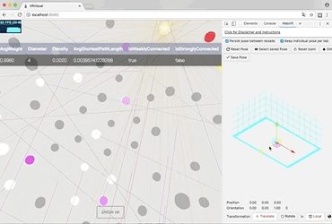

# Impeach

Immersive peach is an immersive analytics tool based on Flask.

## Preview

## Instructions

#### Chrome Canary

1. Download and install [Chrome Canary](https://www.google.com/chrome/browser/canary.html)
2. Launch Chrome Canary
3. In the URL bar, input `chrome://flags#enable-webvr` and choose `Enabled`
4. In the URL bar, input `chrome://flags#enable-gamepad-extensions` and choose `Enabled`
5. Reboot Chrome Canary

#### HTC VIVE

1. Plug in the usb flash drive in your HTC VIVE box
2. Double click the `.exe` file and install HTC VIVE and SteamVR
3. Sign up your HTC VIVE account when HTC VIVE is installed
4. Setup your device according to SteamVR instruction
5. Launch SteamVR and make sure all devices shows green

#### Python 3

1. Download [Python 3](https://www.python.org/downloads)

2. Install Python according to the instruction, please toggle `pip`

3. Install Python packages by pip:

    `pip install flask numpy networkx`

4. Run this project:

   `python /your/path/to/impeach/webservice/main.py`

5. Launch Chrome Canary and input `localhost:8080` in the URL bar